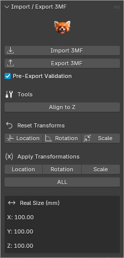
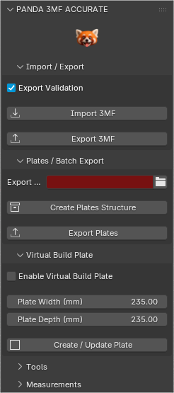

# Panda 3MF Toolbox

**Panda 3MF Toolbox** is a lightweight Blender add-on for importing and exporting **3MF files** with correct real-world scale in millimeters.

This add-on provides a simple and reliable 3MF workflow inside Blender, focused on scale accuracy and compatibility with modern slicers.

This add-on does not modify Blender units or scene scale and works directly with millimeter-accurate data.

---

### STL vs 3MF (Focused on 3D Printing)

| Feature | STL | 3MF |
|--------|-----|-----|
| Scale accuracy | ❌ Does not store units (mm/in) | ✅ Stores real units |
| Import size | ❌ May import too large or too small | ✅ Imports at correct scale |
| Model orientation | ❌ Not preserved | ✅ Preserved |
| Printing information | ❌ Geometry only | ✅ Includes print-related data |
| Colors / materials | ❌ Not supported | ✅ Supported (optional) |
| Import errors in slicer | ⚠️ More common | ✅ Less frequent |
| Manual adjustments | ⚠️ Often required | ✅ Minimal |
| Compatibility | ✅ Very high | ✅ High (modern slicers) |
| Recommended format | ❌ Legacy format | ✅ Modern and recommended |

---

## Features

- Import 3MF files into Blender
- Export 3MF files with correct millimeter scale
- Pre-export validation to prevent common export mistakes
- Detection of unapplied object transforms
- Protection against exporting meshes with active modifiers
- Quick export workflow using the current .blend file location
- Designed for real-world 3D printing workflows

---

## Typical Use Case

1. Import or model geometry in Blender
2. Verify object size
3. Export as 3MF
4. Open the file in your preferred slicer

---

## 🆓 Free vs Accurate Version

| Feature | Free Version | Accurate Version |
|------|--------------|------------------|
| Basic 3MF Import / Export | ✔ | ✔ |
| Standard Save As workflow | ✔ | ✔ |
| Pre-Export Validation | ✔ | ✔ |
| Multi-Material Support | ✖ | ✔ |
| Batch Export (Plates) | ✖ | ✔ |
| Virtual Build Plate | ✖ | ✔ |
| Advanced Tools | Limited | ✔ |
| Real Size Measurements | ✔ | ✔ |

---
<table align="center">
  <tr>
    <td align="center">
      
       <b>Free Version</b>
    </td>
    <td align="center">
      
       <b>Accurate Version</b>
    </td>
  </tr>
</table>

---

### Pre-Export Validation

When enabled, the exporter performs safety checks **before saving the file** to help avoid common 3D printing issues.

#### What this validation checks:

- **Active modifiers**  
  If any mesh has active modifiers (Mirror, Subdivision, etc.), export is blocked and the user must apply them manually.  
  This prevents incomplete or broken geometry in slicers.

- **Unapplied object transforms**  
  If scale or rotation is not applied, the addon lets you choose how to proceed.

#### Available options:

- **Apply & Export**  
  Applies transformations **only to the exported file**, without modifying the original object in Blender.

- **Continue Anyway**  
  Exports the model exactly as it appears, keeping all transforms unapplied.

#### Important notes:

- The addon **never modifies the original Blender objects**
- All corrections are applied only to a temporary export copy
- This allows exporting multiple versions safely without risking the scene

---

## Recommended Blender Units for 3D Printing

This addon is designed to work with Blender’s default metric configuration:

- **Unit System:** Metric
- **Unit Scale:** **1.0**
- **Length:** Millimeters

This setup avoids scale issues, keeps modifiers and addons stable, and ensures consistent results across all slicers (Cura, PrusaSlicer, Orca, Bambu, etc.).

Changing the Unit Scale to **0.001** or relying on slicer-specific behavior may cause incorrect dimensions or export problems.

---

## Limitations

- This add-on does not automatically fix geometry
- No batch export or build plate management in the Free version
- Final print validation is performed by the slicer
- Geometry is exported exactly as defined by the chosen export option

---

## Blender Extensions

Panda 3MF Toolbox is currently under review for Blender Extensions.

The version available on Blender Extensions may lag behind the GitHub repository during the review process.

---

## Support

Please report bugs or issues using **GitHub Issues**.

---

## Credits

Developed and maintained by **Panda Print**.
